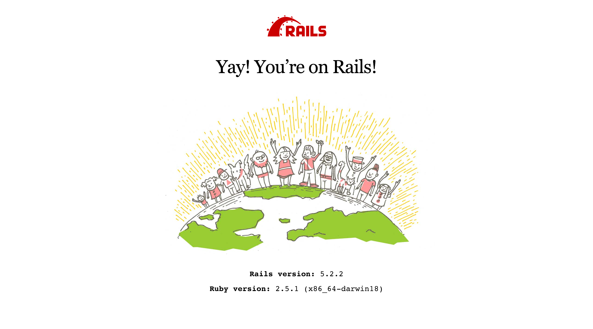

# 為你自己學 Ruby on Rails
## [Reference](https://railsbook.tw/)

## Ruby 生態圈
### Rails 設計哲學
* Convention over Configuration (CoC)
* Don't Repeat Yourself (DRY)

## 環境設定
### Mac 作業系統安裝
```bash
brew install ruby
```

### RVM 管理 Ruby 開發版本
#### 安裝說明
[RVM 官網安裝教學](https://rvm.io/)

#### 使用 RVM
```bash
rvm list known # 列出所有版本的 Ruby
rvm get master # 更新已支援列表
rvm install 2.5.1 # 安裝 Ruby 2.5.1 版
rvm list # 列出已安裝的 Ruby 版本
rvm use 2.5.1 # 使用 Ruby 2.5.1 版為預設版本
rvm system # 回復到系統預設 Ruby 版本
```

### 檢查 Ruby 版本與位置
```bash
ruby -v # 顯示版本
which ruby # 顯示 Ruby 執行檔位置
echo $PATH # 顯示終端指令找尋路徑
```

### Rails 安裝
```bash
gem install rails
rails -v
gem install rails -v 5.1.1 # 安裝不同版本的 Rails
```

### Rails 專案建立
```bash
rails new hello # 建立 hello 專案
cd hello
bin/rails server
```
打開瀏覽器輸入 `http://localhost:3000` 看到 Rails 歡迎畫面

